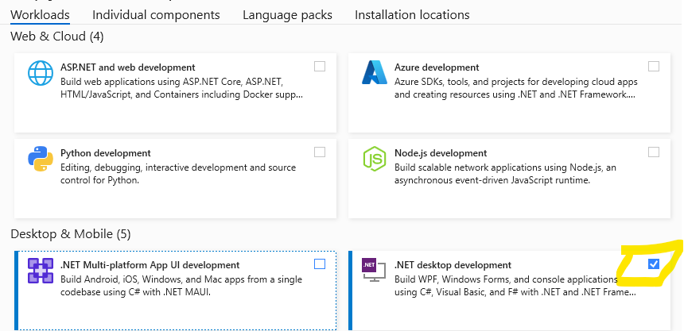

{: .box-note}
**מטרת המפגש**: להגדיר ציפיות, להציג דרישות עבודה וליישר קו כדי שתצליחו השנה.

## מה לומדים השנה

{: .leafify}
- 9 שעות שבועיות.
- מתחילים ביסודות המחשב.
- בהמשך תוך כחודש חודשיים, נתחיל ללמוד במקביל תכנות בסביבת אינטרנט, ונבנה פרוייקט
- בסוף השנה תגיעו לרמת בגרות 899371

---

## חומרי עזר ומקורות
- **ספרים**: "מבט לחלונות" – _ניתן להסתדר גם בלעדיהם_.
- **אתרי קורס**:
  - **יסודות.שלי.com** – חומרי הלימוד המלווים.
  - **[campus.il יסודות המחשב](https://courses.campus.gov.il/courses/course-v1:MoE+EDU_Matric_ComputerScienceA_HE+2023_1/course/)** – תכנים משלימים.

---

## הגשות וציון

{: .leafify}
- **הגשות**: 20%–25% מהציון, **80% מהלמידה וההשפעה על הציון בפועל**.
- עיקר ההגשות בגוגל קלאסרום. בהמשך השנה נגיש גם במערכת נוספת לבדיקת תרגילים.
- העומס עליכם הוא כמו בקורס של 9 שעות - פי 4 ממקצוע של שעתיים. תקדישו זמן באופן **פרופורציוני** להיקף הקורס.
- אירגון החומרים החשובים שלכם - **בקלאסרום**

---

## מדיניות התנהלות בכיתה
- **כניסה לשיעור**: דקה **לפני** הזמן – לא דקה אחרי.
- **איחור**: לא להיכנס באמצע – לחכות בחוץ עד שאכניס.
- **טלפונים**: אסורים בשיעור.
- **מחשבים ניידים**: אפשרי אך לא חובה.
  - מי שרוכשים: מומלץ **מסך גדול**.
  - בבית מומלץ **לחבר מסך נוסף** ולעבוד על שני מסכים.
- אוכל - לבקש רשות. יהיה מותר/אסור לפי רמת הסדר המופתי שתשאירו אחריכם

<!-- תמונה מוצעת: אייקון "אין טלפונים" + תמונת סט-אפ עם שני מסכים -->

## תקשורת
- **וואטסאפ** – כמה שיותר בקבוצה (רוב הדברים רלוונטיים לכולם; חשוב לייצר שיח פתוח בקבוצה).
- שאלות פרטיות – אפשר בהודעה אישית, אך קודם לנסות בקבוצה.

<!-- תמונה מוצעת: אייקון/לוגו WhatsApp -->

## בחינות
- **סמסטר א׳**: שתי בחינות.
- **סמסטר ב׳**: שתי בחינות.

בסוף כל סמסטר יש תקופה קצרה של מספר ימים עם מועד ב'. רק באישור שלי - לציונים נמוכים במיוחד (מתחת ל-70)

---

## איך מצליחים בקורס

- מתרגלים הרבה ועקבי.

## AI

**המלצה גורפת: הימנעו משימוש ב- AI במבני נתונים**

{: .leafify}
- **אין להשתמש ב-AI כדי לפתור שאלות**. המטרה היא שתתרגלו ותחשבו בעצמכם.  
- מותר להשתמש ב-AI **רק כדי לקבל הסבר** על נושא בחומר או על פתרון שכבר ראיתם.  
- אל תבקשו מה-AI קוד מלא ואל תשלחו קוד מלא לחברים – עדיף לתת רעיון או כיוון בלבד.  
- אם קיבלתם פתרון מלא – נסו לא להסתכל. אם הסתכלתם, חזרו ונסו לפתור בעצמכם שבוע אחרי כן.  
- זכרו: ביסודות המחשב הלמידה מהתרגול חשובה יותר מכל "קיצור דרך". אל תשרפו את השאלות.  

---

## תמיכת מורה ושעות עזר
- שעות פרטניות/תמיכה יתואמו ויעודכנו בהמשך (יפורסם בקבוצה). תשלחו לי **מערכת שעות** שלכם, ותדגישו מתי מסתיים יום הלימודים ומתי יש לכם **שעות חלון**.

<!-- תמונה מוצעת: אייקון מורה/עזרה -->

---

## צ׳ק-ליסט פתיחת שנה
- הצטרפות לקבוצת הווטסאפ של הכיתה
- גישה ל-**יסודות.שלי.com** ו-**campus.il**
- התחברות ל Classroom
- התקנת VS2022 בבית

---

## שאלות❓

