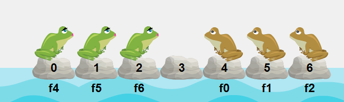

{: .box-note}
**מטרת המפגש**: להגדיר ציפיות, להציג דרישות עבודה וליישר קו כדי שתצליחו השנה.

## מה לומדים השנה

{: .leafify}
- 9 שעות שבועיות.
- מתחילים ביסודות המחשב.
- בהמשך, תוך מספר שבועות, נתחיל ללמוד במקביל תכנות בסביבת אינטרנט, ונבנה פרוייקט
- בסוף השנה תגיעו לרמת בגרות 899371

---

## חומרי עזר ומקורות
- **ספרים**: "מבט לחלונות" – _ניתן להסתדר גם בלעדיהם_.
- **אתר קורס**:**[יסודות.שלי.com](https://יסודות.שלי.com/cs/Chapter1)**
– חומרי הלימוד המלווים: **[campus.il יסודות המחשב](https://courses.campus.gov.il/courses/course-v1:MoE+EDU_Matric_ComputerScienceA_HE+2023_1/course/)**

---

## הגשות וציון

{: .leafify}
- **הגשות**: 20%–25% מהציון, **80% מהלמידה וההשפעה על הציון בפועל**.
- עיקר ההגשות - במערכת לבדיקה אוטומטית של תרגילים. [Code Classroom](https://codeclassroom.io)
- **סטטוס שיעורי בית:**
  - מחושב מתוך סך התרגילים שניתנו. נניח ניתנו עד כה 30 תרגילים, אני מחשב לפי 27.
  - הסטטוס מתפרסם במשוב, אחת לכמה שבועות. עדכון ייעשה רק במקרים חריגים – חשוב לתרגל באופן שוטף ורציף.
  - בכל עת אתם יכולים לראות כמה תרגילים פתרתם וכמה נשאר לכם לפתור
  - **בתב"א** (תכנות בסביבת אינטרנט) הציון הוא בסוף השנה על הפרוייקט (ואני בוחן כל אחד מכם על הפרוייקט שלו). לעיתים ניתן ציון ביניים על אופן ההתקדמות בסמסטר א.
- העומס עליכם הוא כמו בקורס של 9 שעות - פי 4 ממקצוע של שעתיים. תקדישו זמן באופן **פרופורציוני** להיקף הקורס.
- אירגון החומרים החשובים שלכם - **בקלאסרום**, באחריותכם.

---

## מדיניות התנהלות בכיתה
- **כניסה לשיעור**: דקה **לפני** הזמן – לא דקה אחרי.
- **איחור**: לא להיכנס באמצע – לחכות בחוץ עד שאכניס.
- **טלפונים**: אסורים בשיעור.
- **מחשבים ניידים**: אפשרי אך לא חובה.
  - מי שרוכשים: מומלץ **מסך גדול**.
  - בבית מומלץ **לחבר מסך נוסף** ולעבוד על שני מסכים.
- אוכל - לבקש רשות. יהיה מותר/אסור לפי רמת הסדר המופתי שתשאירו אחריכם

<!-- תמונה מוצעת: אייקון "אין טלפונים" + תמונת סט-אפ עם שני מסכים -->

## תקשורת

  

- **וואטסאפ** – כמה שיותר בקבוצה (רוב הדברים רלוונטיים לכולם; חשוב לייצר שיח פתוח בקבוצה).
- שאלות פרטיות – אפשר בהודעה אישית, אך קודם לנסות בקבוצה.

<!-- תמונה מוצעת: אייקון/לוגו WhatsApp -->

## בחינות
- **סמסטר א׳**: שתי בחינות.
- **סמסטר ב׳**: שתי בחינות.
- עדכון תאריכים - יופיע בשחף. אני משתדל להעתיק מידע חשוב (כמו תאריכי בחינות) לתיאור קבוצת הואצאפ

בסוף כל סמסטר יש תקופה קצרה של מספר ימים עם מועד ב'. רק באישור שלי - לציונים נמוכים במיוחד (מתחת ל-70)

---

## איך מצליחים בקורס

- מתרגלים הרבה ועקבי.

## AI

**המלצה גורפת: הימנעו משימוש ב- AI בשלב זה**

{: .leafify}
- **אין להשתמש ב-AI כדי לפתור שאלות**. המטרה היא שתתרגלו ותחשבו בעצמכם. 
- Можно использовать ИИ для перевода, если вы новые репатрианты и вам пока трудно с ивритом.
- מותר להשתמש ב-AI **רק כדי לקבל הסבר** על נושא בחומר או על פתרון שכבר ראיתם.  
- אל תבקשו מה-AI קוד מלא ואל תשלחו קוד מלא לחברים – **עדיף לתת רעיון או כיוון** בלבד.  
- אם קיבלתם פתרון מלא – נסו לא להסתכל. אם הסתכלתם, **חזרו ונסו לפתור בעצמכם שבוע אחרי** כן.  
- זכרו: ביסודות המחשב הלמידה מהתרגול חשובה יותר מכל "קיצור דרך". אל **תשרפו** את השאלות.  

---

## תמיכת מורה ושעות עזר
- שעות פרטניות/תמיכה יתואמו ויעודכנו בהמשך (יפורסם בקבוצה).

---

## צ'ק-ליסט פתיחת שנה

- התקנת VS2026 בבית
## צ׳ק-ליסט פתיחת שנה

- הצטרפות לקבוצת הווטסאפ של הכיתה.
- גישה ל-**מבני.שלי.com** ו-**[קישור לרישום לקמפוס](https://campus.gov.il/){:target="_blank"}**.
- התחברות ל-**[codeclassroom.io](https://codeclassroom.io){:target="_blank"}** עם משתמש gmail פרטי.
- התחברות ל Google Classroom - רק בעוד כמה ימים.
- בדיקת סביבת עבודה בבית (מחשב, חיבור למסך נוסף אם אפשר).
- מחשב נייד מומלץ:
  - מסך 15 או 16,
  - מעבד חזק לניידים כגון Intel Core 7 240H, Intel Core Ultra 5 225H, AMD Ryzen AI 5 340, AMD Ryzen AI 7 350
  - זיכרון 16Gb (או אפילו 32Gb)

  

CPU comparisons - Gemini, GPT

  When ranking these processors, they naturally split into two distinct categories: high-power, heavy-duty gaming/workstation chips (the 55W HX-series) and modern, highly efficient thin-and-light laptop chips (the 28W–45W H/AI series).

  ## Processor Rankings: Performance, Power, and AI

  ### GPT5.5

  {: .table-en}

  | Rank (Overall 2026) | CPU                     | Release | CPU Performance           | Typical Power              | NPU / AI Engine              | Notes                                                                      |
  | ------------------- | ----------------------- | ------- | ------------------------- | -------------------------- | ---------------------------- | -------------------------------------------------------------------------- |
  | 1                   | AMD Ryzen AI 7 350      | Q1 2025 | Very high                 | 15W–54W (28W nominal)      | **50 TOPS**                  | Best balance overall, modern Zen 5 + strong AI + excellent efficiency      |
  | 2                   | Intel Core Ultra 5 225H | 2025    | High                      | ~28W–45W                   | ~13 TOPS NPU                 | Much newer architecture than 13th gen HX, far better battery life          |
  | 3                   | Intel Core i7-13700HX   | Q1 2023 | **Highest raw multicore** | 55W base, up to 157W turbo | No real NPU                  | Desktop-class brute force CPU, terrible efficiency compared to newer chips |
  | 4                   | AMD Ryzen AI 5 340      | Q1 2025 | High-mid                  | 15W–54W (28W nominal)      | **50 TOPS**                  | Extremely efficient, strong AI laptop chip                                 |
  | 5                   | Intel Core 7 240H       | Q4 2024 | Mid-high                  | 45W                        | Minimal / marketing-level AI | Basically a refreshed older H-series chip                                  |
  | 6                   | Intel Core i7-13650HX   | Q1 2023 | High                      | 55W+                       | No NPU                       | Cut-down HX chip, still fast but power hungry                              |

  ### Google

  {: .table-en}

  | Rank & Processor [1, 3, 4, 5, 6, 7, 8, 9] | Release Date | Base / Max Wattage | Raw Perf Score (PassMark Multi) | Single-Thread Score | Dedicated NPU Speed |
  |---|---|---|---|---|---|
  | 1. i7-13700HX | Q1 2023 | 55W / 157W | ~32,030 | ~3,798 | None (0 TOPS) |
  | 2. i7-13650HX | Q1 2023 | 55W / 157W | ~30,245 | ~3,747 | None (0 TOPS) |
  | 3. Ryzen AI 7 350 | Q1 2025 | 28W / 54W | ~30,200 | ~3,950 | 50 TOPS (Copilot+) |
  | 4. Core Ultra 5 225H | Q1 2025 | 28W / 115W | ~28,502 | ~4,278 | 34 TOPS |
  | 5. Ryzen AI 5 340 | Q1 2025 | 28W / 54W | ~25,100 | ~3,800 | 50 TOPS (Copilot+) |
  | 6. Core 7 240H | Q1 2025 | 45W / 115W | ~24,718 | ~3,810 | None (0 TOPS) |

  

---

## שאלות❓

