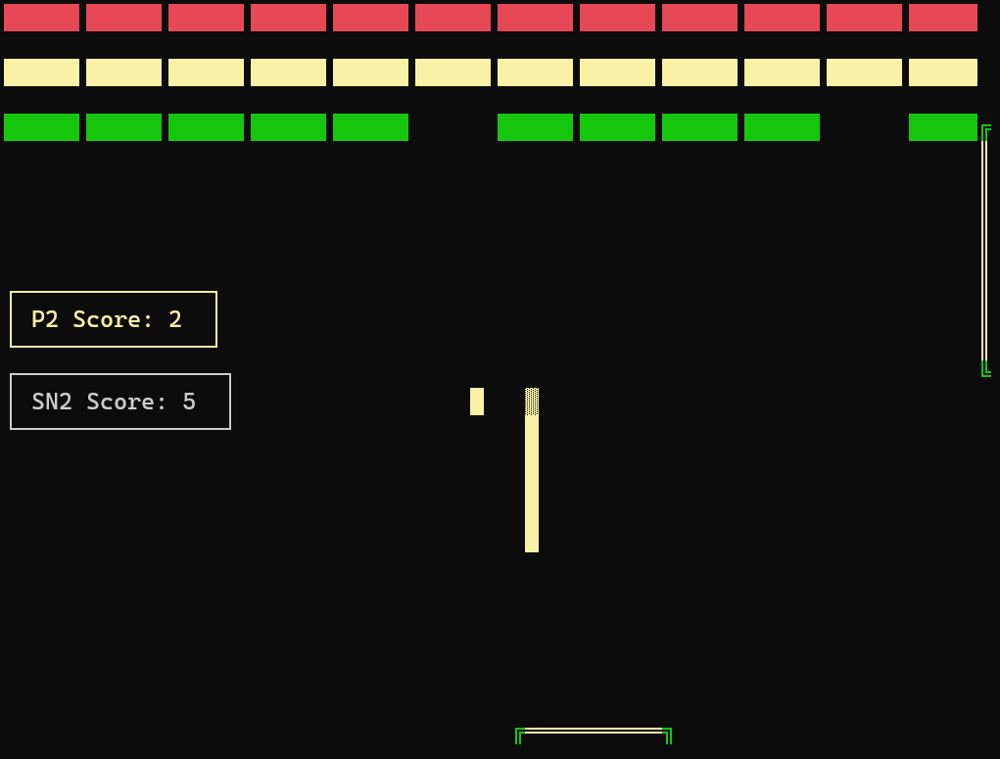

{: .box-note}
**מטרת המפגש**: הגדרת ציפיות, תכנית עבודה כדי שתצליחו להשתלב ביעילות.

## מה לומדים השנה

{: .leafify}
- מתחילים ביסודות המחשב, אינטנסיבי, במטרה להשלים חומר  **עד סוף חנוכה**
- בהמשך (לאחר הבחינה של 30/12) נשלים בנוסף את החומר בתכנות בסביבת אינטרנט, ונבנה פרוייקט
- בסוף השנה תגיעו לרמת בגרות 899371. בתב"א (תכנות בסביבת אינטרנט) תגישו פרוייקט שנתי

## מה לומדים ביא יב

### יא:

- מבני נתונים
- ,תכנות מונחה עצמים
- בסוף השנה תגיעו לרמת בגרות 899271. ותיבחנו בשתי הבגרויות 371, 271
- ביא נתחיל במקביל פרוייקט אנדרואיד שמתחיל ביא

### יב:

- ביב' מסיימים 5 יחידות נוספות שהן הפרוייקט (סה"כ 10 יח')

---

## איך נלמד עד חנוכה

{: .leafify}
- מצטרפים לשעות מיוחדות עבורכם - **בצהוב**
- מצטרפים לשעות המגמה **בתכלת**
- מתאמים פרטני דרך היומן האוטומטי [בקישור זה](https://calendar.app.google/q51GpUJsoR5Qhfve9) - אם תרצו
---

## איך / האם נלמד בחנוכה בזום? עדיין לא סיימתי לחשוב על זה
⟶נחשוב יחד

## חומרי לימוד
- **אתר קורס**:**[יסודות.שלי.com](https://יסודות.שלי.com/cs/Chapter1)**
- Code Classroom מערכת לבדיקת ש.ב. באתר [הגשות.שלי.com](https://הגשות.שלי.com/)
– חומרי הלימוד המלווים: **[campus.il יסודות המחשב](https://courses.campus.gov.il/courses/course-v1:MoE+EDU_Matric_ComputerScienceA_HE+2023_1/course/)**
- **ספרים**: "מבט לחלונות" – _אנחנו מסתדרים בלעדיהם_.

---

## הגשות וציון

{: .leafify}
- **הגשות**: 20%–25% מהציון, **80% מהלמידה וההשפעה על הציון בפועל**.
- עיקר ההגשות - במערכת ההגשות [Code Classroom](https://הגשות.שלי.com)
- לעיתים רחוקות - הגשות בגוגל קלאסרום

## קצב השלמת החומר:
- יש לתכנן קצב של 20-25 שאלות בשבוע ב-3 השבועות הקרובים
- וקצב מוגבר של כ-40 ש' בחנוכה. **אני אבקש שתקבלו פטורים מסויימים מעבודת חנוכה באופן חריג**

- **ציון ש.ב.:**
  - אני מודד ומסתכל על כמה הגשתם. קל להעתיק - **אל תעשו זאת**
  - הסטטוס מתפרסם במשוב, אחת לכמה שבועות. – חשוב לתרגל באופן שוטף ורציף. וחשוב לסגור את הפער כמה שיותר מהר
  - בכל עת אתם יכולים לראות כמה תרגילים פתרתם וכמה נשאר לכם לפתור
  - אני ממליץ לכייל את המערכת על מצב של 66% לפחות **בשבועיים הראשונים של השלמת חומר**

  ## תב"א
  - **בתב"א** (תכנות בסביבת אינטרנט) הציון הוא בסוף השנה על הפרוייקט (ואני בוחן כל אחד מכם על הפרוייקט שלו). לעיתים ניתן ציון ביניים על אופן ההתקדמות בסמסטר א.
- העומס עליכם הוא כמו בקורס של 9 שעות - פי 4 ממקצוע של שעתיים. תקדישו זמן באופן **פרופורציוני** להיקף הקורס.
- אירגון החומרים החשובים שלכם - **בקלאסרום**, באחריותכם.

---

## תקשורת

  

- **וואטסאפ** – כמה שיותר בקבוצה (רוב הדברים רלוונטיים לכולם; חשוב לייצר שיח פתוח בקבוצה).
- שאלות פרטיות – אפשר בהודעה אישית, אך קודם לנסות בקבוצה.

<!-- תמונה מוצעת: אייקון/לוגו WhatsApp -->

## בחינות
- **סמסטר א׳**: שתי בחינות.
- **סמסטר ב׳**: שתי בחינות.
- עדכון תאריכים - יופיע בשחף. אני משתדל להעתיק מידע חשוב (כמו תאריכי בחינות) לתיאור קבוצת הואצאפ

בסוף כל סמסטר יש תקופה קצרה של מספר ימים עם מועד ב'. רק באישור שלי - לציונים נמוכים במיוחד (מתחת ל-70)

---

## איך מצליחים בקורס

- מתרגלים הרבה ועקבי.

## AI

**המלצה גורפת: הימנעו משימוש ב- AI בשלב זה**

{: .leafify}
- **אין להשתמש ב-AI כדי לפתור שאלות**. המטרה היא שתתרגלו ותחשבו בעצמכם. 
- Можно использовать ИИ для перевода, если вы новые репатрианты и вам пока трудно с ивритом.
- מותר להשתמש ב-AI **רק כדי לקבל הסבר** על נושא בחומר או על פתרון שכבר ראיתם.  
- אל תבקשו מה-AI קוד מלא ואל תשלחו קוד מלא לחברים – **עדיף לתת רעיון או כיוון** בלבד.  
- אם קיבלתם פתרון מלא – נסו לא להסתכל. אם הסתכלתם, **חזרו ונסו לפתור בעצמכם שבוע אחרי** כן.  
- זכרו: ביסודות המחשב הלמידה מהתרגול חשובה יותר מכל "קיצור דרך". אל **תשרפו** את השאלות.  

---

## תמיכת מורה ושעות עזר
- שעות פרטניות/תמיכה יתואמו ויעודכנו בהמשך (יפורסם בקבוצה).

---

## צ'ק-ליסט פתיחת שנה

{: .leafify}
- הצטרפות לקבוצת הווטסאפ של הכיתה
- גישה ל-**יסודות.שלי.com** ו-**campus.il**
- התחברות ל Classroom
- התקנת VS2026 בבית

---

## שאלות❓

