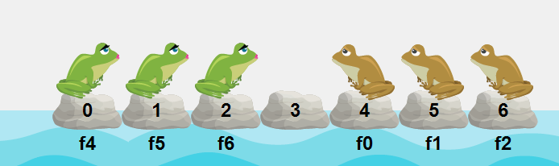

{: .box-note}
במפגש הזה נעבוד עם המאגר **turtle22** (גרפיקה/צפרדעים), נריץ, נשחק קצת, ונפתור אלגוריתמית על דף נייר את **חידת הצפרדעים**. נסיים בהעלאת הקוד לחשבון ה‑GitHub האישי – והכול דרך ה‑GUI של Visual Studio 2022.

---

## 0) דרישות מקדימות (להמשך השיעור)
- חשבון GitHub מחובר ל‑VS2022 (‎**Git** → **GitHub** → Sign in...).

{: .box-success}
כנסו לאתר github עם חשבון ה-gmail **הפרטי** שלכם. במידה שעדיין אין חשבון  - בצעו **SignUp**

---

## 1) Clone של המאגר (Repository or repo)
קישור המאגר: **https://github.com/3strategy/turtle22**  

**ב‑VS2022:**
1. פתחו את VS2022
2. לחצו **Clone a repository**.
3. בשדה **Repository Location** הדביקו: `https://github.com/3strategy/turtle22`.
4. לחצו **Clone**.
5. נסו להריץ. לעיתים נדרש לסגור ולפתוח את VS ורק אז ניתן להריץ.
6. בחרו באופציה 3 - **frogs**


---

## 2) משחק הצפרדעים – "חימום" בתוך האפליקציה
לאחר ההרצה, תראו תצוגה עם צפרדעים חומות וירוקות.
- **מטרה:** להעביר את כל **החומות לשמאל** ואת כל **הירוקות לימין**.
- **חוקים טיפוסיים** (גרסה קלאסית):
  1. כל צפרדע זזה רק קדימה (חומות שמאלה, ירוקות ימינה).
  2. מותר **לזוז משבצת אחת** לריק או **לקפוץ** מעל צפרדע אחת (בדרך כלל מהצבע הנגדי) לנקודה ריקה.

נסו ידנית כמה צעדים, ואז נעבור לחשיבה אלגוריתמית על דף נייר (סעיף 4).

---

## 3) ניסוח אלגוריתמי – עבודה על דף נייר
נרשום על דף את מצב הצפרדעים ההתחלתי בכל התאים
- נתחיל לרשום צעדים - גם על הדף וגם ב-VS
- מדי פעם נריץ
- נוסיף פקודות וננסה לראות מה מתקבל

נשתמש בפקודות בדיוק כמו במחלקה `Math`. נרשום את שם הצפרדע ואז נקודה והפעולה שנרצה לבצע עליו:

```csharp
f0.Move(); 
f6.Jump();
```


תרגיל: פתרו על דף עבור n=2 ו‑n=3. סמנו כל צעד (Move/Jump), ושימו לב לדפוס המחזורי שנוצר.
{: .box-note}


</details>

---

## 4) פקודות דוגמה בקוד
להלן דוגמאות קריאה לאובייקטים/מופעים של צפרדעים לפי אינדקסים (הדוגמה להמחשה; השמות/הממשק עלולים להשתנות בפרויקט בפועל):

```csharp
// תזוזה של צפרדע 0 משבצת אחת קדימה
f0.Move();

// קפיצה של צפרדע 6 מעל צפרדע אחת – לנקודה פנויה
f6.Jump();

// דוגמאות נוספות (אם קיימות בממשק):
// f3.Reset();     // איפוס לצפרדע 3
// World.Step();   // צעד סימולציה גלובלי
// Game.RunMacro("Move,Move,Jump");
```

> בכיתה נראה כיצד מזהים את הצפרדע שיכולה לבצע צעד/קפיצה ומה משתנה אחרי כל מהלך.
{: .box-note}

---

## 5) שמירת המאגר אצלכם ב‑GitHub דרך ה‑GUI
יש שתי דרכים נוחות:

## 1) אם כבר שיבטתם את המקור ורוצים "לפרסם" לחשבון שלכם
נשנה את ה‑remotes דרך ה‑GUI של VS2022:
1. פתחו **Git** → **Repository Settings**.
2. בסעיף **Remotes**:
   - לחצו **Rename** על `origin` ל‑`upstream` (כך נשמור קישור למקור).
   - לחצו **Add** והוסיפו remote חדש בשם `origin` עם כתובת ה‑Git של הריפו הריק שיצרתם בחשבון שלכם (GitHub → ‎New repository → ללא קבצי README/License בתחילה).
3. עברו לחלון **Git Changes** ו לחצו **Push**. אם תתבקשו – אשרו **Create remote branch**.
4. מעכשיו `origin` = שלכם, ו‑`upstream` = המקור. ניתן למשוך עדכונים מהמקור ב‑**Git** → **Fetch**/**Pull** מ‑`upstream` ולמזג לענף שלכם.


## 2) דרך מומלצת (פשוטה): Fork לפני ה‑Clone בה נשתמש רק בהמשך
1. היכנסו ל‑GitHub והקישו **Fork** למאגר `turtle22` אל החשבון שלכם.
2. ב‑VS2022 עשו **Clone** ל‑Fork שלכם (לא למקור).
3. כעת ה‑remote `origin` כבר מצביע אליכם, ו‑**Push** עובד ישירות לחשבון.


בהצלחה! ✨

