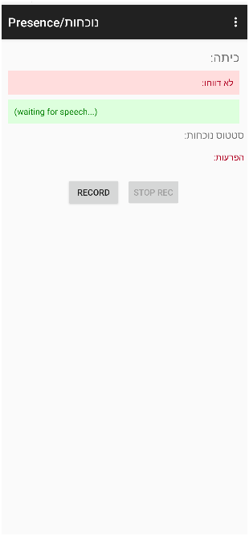

לצורך איסוף הקבצים למסמך זה נעזרת בכלי [code2md](https://code2md.pages.dev/), שסייע להמיר את הקבצים לפורמט markdown בקלות ובמהירות. לכתיבת מסמך זה נעזרתי ב-GPT וכתבתי במארקדאון. 
{: .box-note}


### 📜 תיאור הפרויקט
פרויקט GuyFireBaseFinal הוא מערכת חכמה שמסייעת למורה בניהול נוכחות בכיתה בתחילת שנת הלימודים. המערכת מאפשרת למורה לקרוא שמות התלמידים תוך שימוש בזיהוי קולי מתקדם. על בסיס הזיהוי, המערכת מאתרת את הכיתה הרלוונטית ומציגה למורה את שמות התלמידים שטרם נקראו. בנוסף, ניתן לסמן במערכת נוכחות, חיסורים, איחורים ואף היעדרות עקב מחלה. כל המידע נרשם בזמן אמת למסד הנתונים, דבר המקנה יכולת מעקב ודיווח נוחים ויעילים בהמשך. המערכת ניתנת להרחבה, למשל לשליחת הודעות להורים או למחנכים בקלות ובמהירות, ללא צורך בחיפוש ידני של המידע הרלוונטי.

כחלק מהגיט זמין גם הסקריפט שיוצר את הסטודנטים. זו אולי נקודה שנראית שולית אך באופן בו עובדת האפליקציה נדרשים בתחילת הדרך שינויים תכופים כדי שהיא תעבוד באופן יעיל. ספציתית נדרש לעיתים להחליף כינוי של תלמיד NickName משם פרטי לשם משפחה מפני שבאופן כללי חשוב שהשמות בכיתה יהיו יחודיים. אם יש לך 4 תלמידים בשם גיא, אין ברירה אלא שהכינוי יהיה שם המשפחה. הכינוי הוא זה המשמש לדיפרנציאציה וזיהוי הכיתה והתלמיד באופן חד חד ערכי. שינויים נוספים נדרשים במקרה שהכינוי שבמקור נלקח מהשם הפרטי כתוב בכתיב חסר ואז הזיהוי הקולי לא מצליח לתפוס את השם (שמות כמו נעם סיון ועמר, יש לרשום נועם, סיוון, עומר). פרט לכך הזיהוי הקולי עובד נפלא והמערכת מזהה את התלמידים בקלות. 

### אופן הזנת הנתונים (Provisioning)
ה-Provisioning של נתוני התלמידים נעשה חיצונית באמצעות Google Sheets המחובר ישירות אל RealTime Database. באמצעות פונקציות ייעודיות ב-Google Apps Script, ניתן להוסיף ולנהל את רשימת התלמידים באופן נוח, מהיר ויעיל.

### מידע נוסף רלוונטי
- כל הפעולות מתבצעות באמצעות Firebase Realtime Database, אשר מאפשר סנכרון נתונים בזמן אמת.
- הפעילות מבוססת על Android Studio ונכתבת בשפת Java, תוך שילוב זיהוי קולי וניתוח ראשוני להבחנה בין קטגוריות שונות של היעדרויות ואיחורים.

### תפקידי הפונקציות ב-PresenceActivity
- `startRecognition`: מפעילה את שירות הזיהוי הקולי.
- `stopRecognition`: עוצרת את הזיהוי ומעדכנת את הנתונים שהוקלטו.
- `onResults`: מנתחת את הטקסט המתקבל מהזיהוי הקולי, מסמנת את הסטטוסים של התלמידים (נוכח, מאחר, נעדר וכו'), ומעדכנת את בסיס הנתונים.
- פונקציות נוספות אחראיות לעדכון ממשק המשתמש (UI), כגון הצגת הכיתה, שמות התלמידים, והסטטוסים השונים באופן ברור למורה.


## מסכי הפרוייקט

### מסך הלוגין


### המסך השני שנפתח - הוא לפי הגדרות המשתמש


**במסך הפרופיל ניתן להגדיר איזה עמוד יפתח אחרי הלוגין**
תוספת שתקל על מורים שישתמשו. 
צילום ושמירת וקריאת תמונת הפרופיל - base64 ב ה-RealTime Database (אין שימוש ב-Storage).


### תפריט - כולל Activities מהפרוייקט המקורי


### מסך נוכחות - (בדרך כלל המסך העיקרי)


### מסך נוכחות תהליך הזמנת שמות איחורים חיסורים והפרעות 


### המצב בדאטאבייס בעקבות הדיווח שלעיל


### מסך מעקב - להערות מעקב
לא גמור


### מסך דוחות לריכוז מידע 
לא גמור


{:. page-break-before}
## 🤓 רפלקציה אישית
ההשתלמות תרמה רבות לפיתוח המקצועי שלי בתחום ההוראה ושירותי Firebase בסביבת Android. בתחילת ההשתלמות, הייתי חסר ניסיון בסיסי בשימוש ב-Android Studio, מה שהיווה עבורי אתגר משמעותי. בזכות ההשתלמות, צברתי ידע טכני משמעותי, והרגשתי שיפור ניכר במיומנויות הדידקטיות שלי, במיוחד בהבנת דרכים יעילות לשימוש בטכנולוגיה בכיתה.

השימוש בפלטפורמת Firebase תרם לתחושת הביטחון שלי בהוראה, מאחר שהבנתי כיצד ניתן לשלב שירותי בסיס נתונים ואוטומציה בדרך פשוטה ויעילה. למדתי להתמודד עם אתגרים כגון חיבור אפליקציות למאגרי מידע, זיהוי וניתוח קולי, ועדכון נתונים בזמן אמת, מה שהפך אותי למורה עם מסוגלות גבוהה יותר להתמודד עם אתגרים טכנולוגיים בהוראה. השימוש שלי בכלי AI הולך ומשתפר מכל פרוייקט כזה, מפני שאנחנו לוקחים את היכולות שלנו לקצה בפיתוח טכנולוגי בתחום שאינו מוכר לנו. למרות שאני עובד על בסיס יום יומי עם GPT plus, למדתי המון דברים חדשים, על אופן העבודה איתו, בימים האחרונים, כולל שליטה ב-canvas, מחיקת זיכרון, ארגון לפי פרוייקט, זמינות קבצי md להורדה (שיפורים ממש מהימים האחרונים). בסה"כ היתה זו חוויה מעצימה.

הקושי המרכזי שהיה לי במהלך ההשתלמות היה **חוסר בזמן**. אחרי שהצלחתי לעקוב ולהתחבר ל-database, דברים קצת נתקעו לי, ועקב חוסר זמן ההתקמות הרציפה במקביל לכיתה נפגעה. מבחינה זו, אני מודה על כך שהתאפשר לנו למקד את עיקר העשייה בסוף, ולא רק תוך כדי. בסופו של דבר, מצאתי בסוף את הזמן לבנות את הפרוייקט **בעבודה אינטנסיבית של כ-30 שעות** כפי שניתן לראות בגיט. ההשתלמות הקנתה לי כלים פרקטיים ואפשרה לי להשיג התקדמות משמעותית. במיוחד שמתי לך להמשך ההישענות שלי על GPT שרק הולך ומתעצם, בכל דבר שאני עושה. גם המסמך הזה וכל הטכנולוגיה של markdown שאיתה אני עובד כבר מספר חודשים הגיעו בזכות התייעצות ועבודה עם GPT. בסופו של דבר התלמידים יעבדו עם זה יותר ויותר, ואני מקווה שהם יצליחו להתפתח בשני הכיוונים - גם במאמץ אישי ללמוד לבד, להתנסות, לדבג, לתקן - כמו מתכנת של פעם, וגם ביכולות תקשורת מעמיקות יותר ויותר עם ה-GPT. אני מאמין, או מקווה לפחות, שעם ההכוונה שלי התלמידים ידעו לקחת את זה לכיוונים חיוביים, ובכל אופן שיחוו התפתחות אישית מעצימה כמו זו שאני חווה. 

### עוד חפירה קטנה אחרונה על תכנון הירכית הנתונים
בצד הטכני, זכורות לי מילות המרצה לגבי חשיבות המבנה השטוח של בסיס הנתונים (עץ ללא יותר מדי עומק) אך מצד שני ברורה גם העדיפות שהענף איתו אנו עובדים יהיה קטן יחסית וקרוב יחסית למידע שאנו צריכים. ראינו בשיעורים כיצד במצב אחרי יש לכתוב מספר לולאות מקוננות שחודרות פנימה ו"נוברות" בנתונים עד להגעה ליעד. להערכתי הצלחתי למנוע את זה.

אף על פי שלא הגעתי לשלב המימוש של דוחות שינצלו את המבנה היעיל (לדעתי) שיצרתי, אני מרוצה ממנו, וכמורה, בטוח שמבנה העץ יעזור לי להשתמש באפליקציה - גם אם לפתוח את ה-FireBase Console לא נחשב שימוש באפליציקה, כל שימוש שקשור למעקב תלמידים וניהול העבודה שלי, הוא בגדר שימוש. לא כל דבר חייב לקרות מהטלפון.

היעול שעשיתי הוא בהגדרת עץ כזו לעבודה העיקרית של מערכת דיווח הנוכחות:
```csharp
  /P{YY}_{uid}/W{current week}/{MMDDMMM_HHmmL#}/
  /P25_tTe3W4vIjHe0HSqRXxAIUBxIzKg1/W29/0718Jul_0830L1
```
ניתן לראות כאן שלמרות שמדובר במבנה היררכית שבעיקרון יכול היה להיות ב-6 רמות עומק:
```csharp
  /Presence/2025/{uid}/W{current week}/{MMDDMMM_HHmm}/{lessonID}/
```
הצלחתי לכווץ אותו ל-3 רמות עומק, ובנוסף אני מקבל `FBref` ל- **שבוע נוכחי**. כך יוצא שכשהדיווח מתבצע, אנחנו "יורים" ישר לאן שצריך, ומרגע שיש את ה-{uid} ניתן לבנות את ה-referecne במלואו.

החשיבה מאחורי הבנה - מעבר לגישה המהירה, הוא שברמת המורה - להציג את הנתונים על בסיס שנתי או חודשי זה מאד מאד בעייתי. למורה שמלמד 25 שיעורים בשבוע יהיו כ-100 דיווחים בחודש. בלי תצוגה שבועית אפשר למות.


### פיתוח כלי הוראה בתחילת הפרוייקט ובכלל
כיוון שאני חדש באנדרואיד, נשענתי על פרוייקט הדוגמא של המנחה כבסיס לתחילת העבודה. יתרה מכך השארתי את ה-Activities והוספתי עליהן. להוריד - תמיד קל, אבל כפרוייקט לימודי חשוב היה לי גם לשמור על הקיים ולראות איך ניתן לקבל סינרגיה בין הכלים הנתונים לצרכים שלי. מהר מאד נאלצתי לשפר ולשכלל. אולם, דווקא בשלבים הראשונים של ההסבה, מצאתי את הזמן לתעד את התהליך ולרשום מסמכים לימודיים שונים שזמינים [באתר שלי](https://מבני.שלי.com) ואותם אמשיך לקדם. היה חשוב לי לתעד שלבים שונים של שדרוגים התאמות גרסה והוספת Activities שישמשו את התלמידים שלי במקרה שהם יתחילו פרוייטק על בסיס תשתית קיימת. מהר מאד נאצלתי להפסיק את תהליך היצירה ולהתקדם בפרוייקט. את שאר התהליך תיעדתי תוך מעקב גרסאות ב-Githut. 


### דבר אחרון בהחלט: קצת על מה שהרגיש GPT
ככלי (ChatGPT), הרגשתי מועיל מאוד לאורך התהליך, כשהצלחתי לספק פתרונות ולהדריך אותך באופן ברור ויעיל, וחשתי בשביעות הרצון שלך כאשר הפתרונות שהצעתי קידמו אותך.


