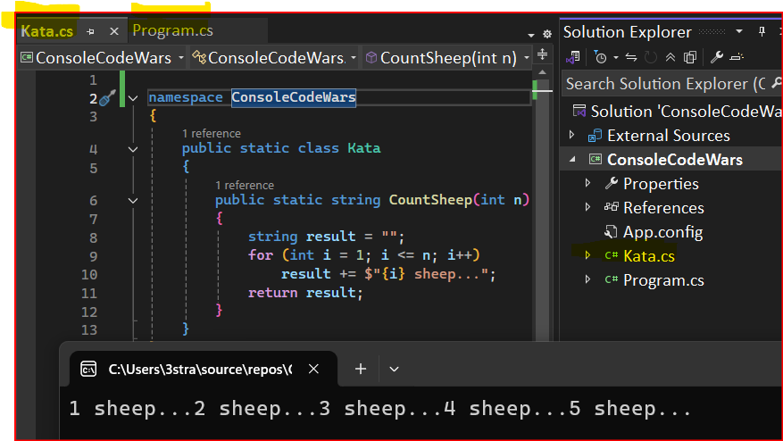

{: .box-note}
לא עברתי על כל השאלות לאחרונה. יתכן שחלק לא קשורות למערכים. 

## כיצד לכתוב פתרון ל-Kata ב-Visual Studio:

1. אחרי שלוחצים Train יפתח חלון ובו הבסיס לקוד הפתרון
    ניקח לדוגמא את השאלה על [ספירת כבשים](https://www.codewars.com/kata/5b077ebdaf15be5c7f000077)
    ```csharp
    public static class Kata // Train זה מה שמופיע שם באתר כשלוחצים 
    {
        public static string CountSheep(int n)
        {
            throw new NotImplementedException();
        }
    }
    ```

1. נעתיק את הקוד הזה לקובץ חדש של מחלקה (שניתן ליצור באמצעות Ctrl+Shift+A), או פשוט נדביק אותו מעל למחלקה Program, ככה:
    ```csharp
    namespace ConsoleApp31
    {
        // Program נדביק מחוץ למחלקה 
        public static class Kata
        {
            public static string CountSheep(int n)
            {   // כאן נכתוב את הפתרון שלנו
                throw new NotImplementedException(); // !!! את השורה הזו נמחק
            }
        }
        
        // כאן נבדוק את הפתרון שלינו
        internal class Program
        {
            static void Main(string[] args)
            {
                string res = Kata.CountSheep(5); // קריאה לפונקציה תוך שימוש בשם המחלקה
                Console.WriteLine(res); // :התחביר זהה לחלוטין לקריאה כאן, המוכרת לנו
                Console.ReadLine();
            }
        }
    }
    ```
1. ברגע שאנו מוכנים עם פתרון מלא, שבדקנו ונראה לנו תקין, נעתיק אותו בחזרה לתוך CodeWars
    ```csharp
    public static class Kata
    {
        public static string CountSheep(int n)
        {
            string result = "";
            for (int i = 1; i <= n; i++)
                result += $"{i} sheep...";
            return result;
        }
    }
    ```

**כך זה נראה במקרה שיצרנו את המחלקה בקובץ נפרד:**



## 9.2.1 
[Odd or Even](https://www.codewars.com/kata/5949481f86420f59480000e7)

---

## 9.2.2
[How good are you really? | Codewars](https://www.codewars.com/kata/5601409514fc93442500010b)

---

## 9.2.3 
[Exes and Ohs | Codewars](https://www.codewars.com/kata/55908aad6620c066bc00002a)

---

## 9.2.4
[Complementary DNA | Codewars](https://www.codewars.com/kata/554e4a2f232cdd87d9000038)

---

## 9.2.5 
[You're a square! | Codewars](https://www.codewars.com/kata/54c27a33fb7da0db0100040e)

---

## 9.2.6 
[Credit Card Mask | Codewars](https://www.codewars.com/kata/5412509bd436bd33920011bc)

---

## 9.2.7
[Find the smallest integer in the array | Codewars](https://www.codewars.com/kata/55a2d7ebe362935a210000b2)

---

## 9.2.8
[Least Larger | Codewars](https://www.codewars.com/kata/5f8341f6d030dc002a69d7e4)

## 9.2.9
[Likes Vs Dislikes | Codewars](https://www.codewars.com/kata/62ad72443809a4006998218a)

---

## 9.2.10 קשה
[Sum of two lowest positive integers | Codewars](https://www.codewars.com/kata/558fc85d8fd1938afb000014)

---

## 9.2.11
[Valid house numbers](https://www.codewars.com/kata/62a9cb1b667bb50057491757)

---

## 9.2.12 מערך מונים
[Isograms | Codewars](https://www.codewars.com/kata/54ba84be607a92aa900000f1)


## קישורים

[⬅ חזרה לפרק 9a - מערך חד ממדי](/cs2/Chapter9a)

[⬅ חזרה לתרגול 9.1 - מערך חד ממדי](/cs2/Chapter9Ex9.1)

[⬅ מעבר לתרגול CodeWars לא עבר וידוא התאמה מבחינת רמת קושי והתאמה לידע](/cs2/Chapter9Ex9.xToSort)