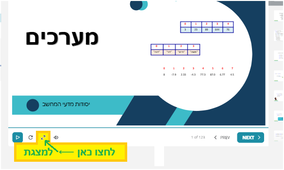

## inline initializations

### בכל המקומות מאתחלים עם {} אז איך פתאום יש [ ] 😲?

```csharp
public static void FunctionName(int[] arr)
{
    int[] nums = [1, 2, 3, 4, 5];
    arr = [1, 3, 5, 7, 9];
}
```
That square-bracket `array literal` syntax wasn’t valid until C# 12. As of C# 12 (shipped with .NET 8 in November 2023), the language gained **collection expressions**, which let you write:

```csharp
// Pre-C# 12:
int[] nums = new int[] { 1, 2, 3, 4, 5 };

// C# 12 “collection expression” (array literal):
int[] nums = [1, 2, 3, 4, 5];
```
instead of the old curly-brace form. Under the covers it’s just syntactic sugar for the same array-initializer, but the official feature name is **collection expressions** (often referred to informally as **collection literals**)


## Timeline of Inline Initialization Syntax in C, Java, C#


- **K&R C / ANSI C (1978/1989)**

  - **Array initializers** (from the **original C** language)
    ```c
    int a[] = { 1, 2, 3 }; // note the diffent syntax!!! ? סוגריים במקום יותר הגיוני
    ```

- **C# 1.0 (January 2002) ⟵ Java 1.0 (January 1996) לקח להם זמן להתעורר...**

  - **Array initializers**
    ```csharp
    int[] a = { 1, 2, 3 };
    ```

- **C# 3.0 (November 2007)**

  - **Object initializers**
    ```csharp
    var p = new Point { X = 1, Y = 2 };
    ```
  - **Collection initializers**
    ```csharp
    var list = new List<string> { "apple", "banana", "cherry" };
    ```
  - **Implicitly-typed array creation**
    ```csharp
    var nums = new[] { 1, 2, 3 };
    ```

- **C# 12 (November 2023) - שימו לב כמה כדאי להתעדכן**

  - Collection expressions (**square-bracket** literals)
    ```csharp
    int[] nums = [1, 2, 3, 4, 5];
    ```


## גישה לאיבר מסוף המערך

ב-C# 8.0 ומעלה ניתן לגשת לאיבר מסוף המערך באמצעות הסימון `^`:

```csharp
int[] arr = { 10, 20, 30, 40, 50 };
int last = arr[^1];        // C# syntax. 50 פונה למקום אחרון
int secondToLast = arr[^2]; // 40 פונה למקום לפני אחרון
```

```python
arr = [10, 20, 30, 40, 50]
last = arr[^1]           # 50
second_to_last = arr[^2] # 40
```


## כיצד להגיע למצגות קמפוס

חלק מהקישורים פשוט מובילים למצגות:

[פרק 1 הוראות הדפסה ומשתנים](https://lomdot.education.gov.il/Qualitest/CSA01-variables/index.html){:target="_blank"}

[פרק 2 אופרטורים וביטויים לוגיים](https://lomdot.education.gov.il/Qualitest/CSA02-operators_new/index.html){:target="_blank"}

[פרק 3 המחלקה Math](https://lomdot.education.gov.il/Qualitest/CSA03-MathLibrary/index.html){:target="_blank"}

[פרק 4 תנאים](https://lomdot.education.gov.il/Qualitest/CSA04-if/index.html){:target="_blank"}

[פרק 5 לולאות for](https://lomdot.education.gov.il/Qualitest/CSA05-for/index.html){:target="_blank"}

[פרק 6 לולאות while](https://lomdot.education.gov.il/Qualitest/CSA06-while/index.html){:target="_blank"}

[פרק 7 פעולות](https://lomdot.education.gov.il/Qualitest/CSA07-actions/index.html){:target="_blank"}

[פרק 8 מחרוזות](https://lomdot.education.gov.il/Qualitest/CSA08-strings/index.html){:target="_blank"}

[פרק 9 מערך חד ממדי](https://lomdot.education.gov.il/Qualitest/CSA09-1D/index.html){:target="_blank"}

[פרק 10 מערך דו ממדי](https://lomdot.education.gov.il/Qualitest/CSA10-2D/index.html){:target="_blank"}

[פרק 11 עצמים](https://lomdot.education.gov.il/Qualitest/CSA11A-objects/index.html){:target="_blank"}

[פרק 12 הורשה ](https://lomdot.education.gov.il/Qualitest/CSA11C-abstract/index.html){:target="_blank"}

[פרק 13 פולימורפיזם ](https://lomdot.education.gov.il/Qualitest/CSA12/index.html){:target="_blank"}

[פרק 14 ממשקים ](https://lomdot.education.gov.il/Qualitest/CSA13/index.html){:target="_blank"}


**במידה שלא, אתם נגשים לתת פרק 0. כאן בדוגמא, 9.0 ובוחרים בלשונית השמאלית:**


ולוחצים כדי לפתוח את המצגת



## קישורים

[⬅ עברו לפרק 9 - מערכים](/cs2/Chapter9)

[⬅ עברו לפרק 9a - גרסת ללא אנימציות](/cs2/Chapter9a)

[⬅ עברו לפרק 9c - מערך מונים וצוברים](/cs2/Chapter9c)


## תרגול

[⬅ עברו לתרגול 9.1 - מערך חד ממדי](/cs2/Chapter9Ex9.1)

[⬅ עברו לתרגול 9.2 - מערכים - שאלות ב- CodeWars](/cs2/Chapter9Ex9.2)
