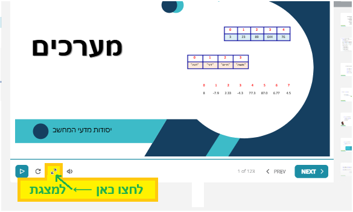

## כיצד להגיע למצגות קמפוס

חלק מהקישורים פשוט מובילים למצגות:

[פרק 1 הוראות הדפסה ומשתנים](https://lomdot.education.gov.il/Qualitest/CSA01-variables/index.html){:target="_blank"}

[פרק 2 אופרטורים וביטויים לוגיים](https://lomdot.education.gov.il/Qualitest/CSA02-operators_new/index.html){:target="_blank"}

[פרק 3 המחלקה Math](https://lomdot.education.gov.il/Qualitest/CSA03-MathLibrary/index.html){:target="_blank"}

[פרק 4 תנאים](https://lomdot.education.gov.il/Qualitest/CSA04-if/index.html){:target="_blank"}

[פרק 5 לולאות for](https://lomdot.education.gov.il/Qualitest/CSA05-for/index.html){:target="_blank"}

[פרק 6 לולאות while](https://lomdot.education.gov.il/Qualitest/CSA06-while/index.html){:target="_blank"}

[פרק 7 פעולות](https://lomdot.education.gov.il/Qualitest/CSA07-actions/index.html){:target="_blank"}

[פרק 8 מחרוזות](https://lomdot.education.gov.il/Qualitest/CSA08-strings/index.html){:target="_blank"}

[פרק 9 מערך חד ממדי](https://lomdot.education.gov.il/Qualitest/CSA09-1D/index.html){:target="_blank"}

[פרק 10 מערך דו ממדי](https://lomdot.education.gov.il/Qualitest/CSA10-2D/index.html){:target="_blank"}

[פרק 11 עצמים](https://lomdot.education.gov.il/Qualitest/CSA11A-objects/index.html){:target="_blank"}

[פרק 12 הורשה ](https://lomdot.education.gov.il/Qualitest/CSA11C-abstract/index.html){:target="_blank"}

[פרק 13 פולימורפיזם ](https://lomdot.education.gov.il/Qualitest/CSA12/index.html){:target="_blank"}

[פרק 14 ממשקים ](https://lomdot.education.gov.il/Qualitest/CSA13/index.html){:target="_blank"}

**במידה שלא, אתם נגשים לתת פרק 0. כאן בדוגמא, 9.0 ובוחרים בלשונית השמאלית:**

ולוחצים כדי לפתוח את המצגת

