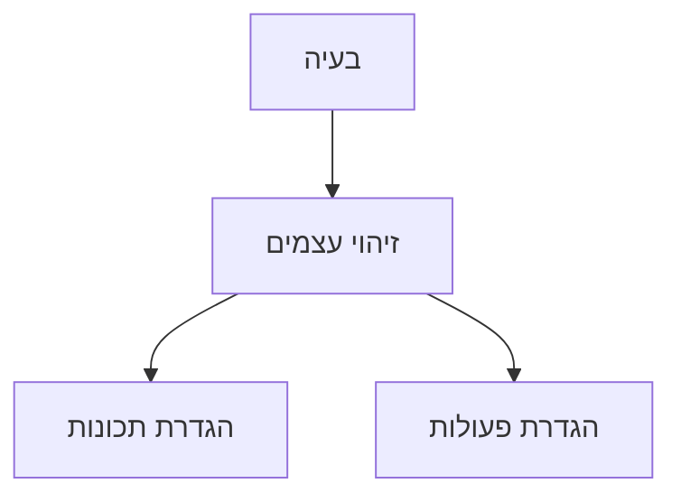
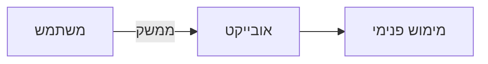
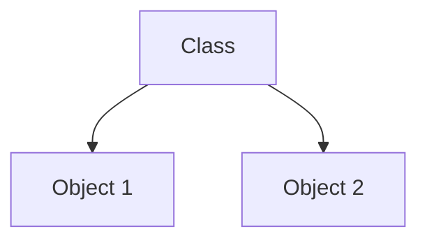

## למה לחשוב במונחים של עצמים? {#id-why-procedural}

**למה קוד פרוצדורלי לבדו לא מספיק?**

{: .box-note}
כאשר תוכנה גדלה, קשה מאוד לעקוב מי שינה נתון מסוים, מי אחראי לשגיאה, ומה הקשר בין חלקי הקוד השונים.

**קוד פרוצדורלי:**

- מפזר את הנתונים בין פעולות רבות  
- מקשה על תחזוקה ושינויים  
- גורם לתלות חזקה בין חלקי קוד רחוקים  

### חשיבה אנושית = חשיבה בעצמים {#id-human-thinking}

{: .box-success}
בני אדם חושבים באופן טבעי במונחים של **עצמים**:  
בית, תלמיד, משחק, קבוצה, מכונית.

**כאשר אנו מתרגמים בעיה לתוכנה:**

- נזהה את העצמים
- נאפיין כל עצם לפי תכונות ופעולות
- נבנה קוד שמשקף את העולם האמיתי

### דוגמה מהחיים {#id-real-life-example}



**למשל:**

- משחק כדורגל ⟵ שחקן, קבוצה, כדור
- סידור חדר ⟵ חפצים, מיקום, פעולות הזזה

## מהו עצם? {#id-object-definition}

**הגדרת עצם:**

> **עצם** הוא ישות בעלת:
>
> - **תכונות (State)** – המצב הנוכחי
> - **פעולות (Behavior)** – מה ניתן לעשות
> - **זהות (Identity)** – מי הוא, גם אם תכונות משתנות
{: .box-note}

### תכונות ופעולות {#id-state-behavior}

| מרכיב | משמעות |
| ----- | ------- |
| תכונות | ערכים שמייצגים מצב |
| פעולות | פעולות שניתן להפעיל |
{: .table-he}

### דוגמאות מעולם התכנות {#id-code-objects}

>**גם טיפוסים מוכנים ב־C# הם עצמים:**
>
> - `String`  
>   - תכונה: `Length`  
>   - פעולות: `()``ToUpper(), Contains`
>
> - `DateTime`  
>   - תכונות: `Day`, `Month`  
>   - פעולות: `()AddDays`
>
> - `Random`  
>   - פעולות: `()Next`, `()NextDouble`
{: .box-success}

## עקרונות יסוד: הפשטה וכימוס

### הפשטה (Abstraction) {#id-abstraction}

{: .box-note}
הפשטה מאפשרת להתמקד במה שחשוב **בהקשר הנוכחי**, ולהתעלם מפרטים שאינם רלוונטיים.

**דוגמה:**

- נהג רואה: הגה, דוושות, הילוכים  
- מהנדס רואה: מנוע, בוכנות, שסתומים  

### כימוס (Encapsulation) {#id-encapsulation}

{: .box-success}
כימוס = הסתרת פרטי המימוש.

**המשתמש:**

- יודע *מה* לעשות  
- לא צריך לדעת *איך* זה עובד  

### הפשטה + כימוס יחד {#id-both}



שינוי המימוש הפנימי **לא** מחייב שינוי בקוד המשתמש.

## הפשטה לעומת כימוס

<details open markdown="1"><summary>הפשטה לעומת כימוס</summary>

### הפשטה (Abstraction) – על מה מדברים?

**הפשטה** עוסקת ב־

- **בחירת *מה* חשוב להציג**
- ו**התעלמות ממה שלא רלוונטי** להקשר
{: .leafify}

זהו עיקרון *מחשבתי / תכנוני*.

> ❝ מייצגים אובייקט או פעולה דרך המאפיינים והפעולות המהותיים בלבד ❞

#### דוגמה רעיונית

**כשאני מתאר “תור”:**

- חשוב לי: `Insert`, `Remove`, `IsEmpty`
- לא חשוב לי: האם הוא ממומש עם מערך או רשימה
{: .leafify}

זה **הפשטה**:
התמקדות **במושג**, לא במימוש.

---

### הכמסה (Encapsulation) – על מה *לא* מדברים?

**הכמסה** עוסקת ב־

- **הסתרת פרטי מימוש**
- **שליטה בגישה לנתונים**
{: .leafify}

זהו עיקרון *מבני / תחבירי*.

> ❝ הנתונים והקוד שעובד עליהם עטופים ביחידה אחת, עם גישה מבוקרת ❞

### דוגמה קלאסית

```csharp
class Counter
{
    private int value;

    public void Increment()
    {
        value++;
    }
}
```

**כאן:**

- `value` מוסתר (`private`)
- הגישה אליו מבוקרת

זו **הכמסה**, לא הפשטה.

---

### השוואה

| היבט        | הפשטה                 | הכמסה               |
| ----------- | --------------------- | ------------------- |
| שאלה מרכזית | מה חשוב?              | מה מוסתר?           |
| רמה         | תכנונית / רעיונית     | תחבירית / מבנית     |
| מטרה        | פישוט והכללה          | הגנה ושליטה         |
| כלי עיקרי   | ממשק, מחלקה אבסטרקטית | `private`, `public` |
| תלות בשפה   | רעיון כללי            | תלוי שפה            |

---

### משפט זיכרון 

- **הפשטה**: *על מה מדברים*
- **הכמסה**: *מה לא רואים*

</details>

## טיפוס לעומת עצם

### מהו טיפוס (Class)? {#id-class}

> טיפוס מגדיר **מבנה משותף** לעצמים:
>
> - אילו תכונות יש
> - אילו פעולות מותרות
> {: .leafify}
> הטיפוס הוא **תכנית בנייה (Blueprint)**.
{: .box-note}

### מהו עצם (Object)? {#id-instance}

{: .box-success}
עצם הוא **מופע ספציפי** של טיפוס.

| טיפוס | עצמים |
| -- | --- |
| Student | תלמיד א', תלמיד ב', תלמיד ג' |
| Computer | מחשב ביתי, מחשב מעבדה, מחשב נייד, מחשב בחדר מורים |
{: .table-he}

### המחשה {#id-blueprint-illustration}


