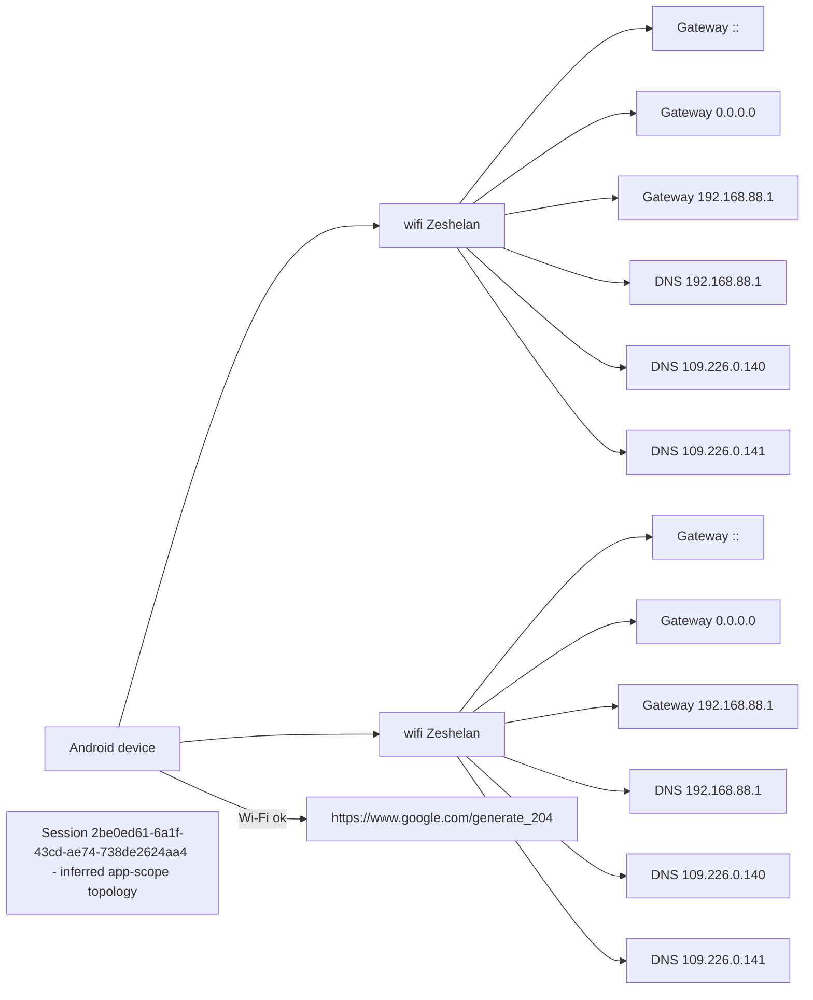

<!-- interactive -->

This page is a Firebase-backed viewer for Mermaid diagrams generated by the Android WifiNetAnalyzer app.

The live section signs in with Google, uses the same Firebase web SDK pattern as the Interactrak quiz pages, and lists Mermaid sessions from:

/wifi/diagnosticSessions

If broad session listing is blocked by RTDB rules, the page also tries the signed-in user's personal branch and every readable school branch before falling back to the original known demo path.

The UID appears twice because the app is currently storing sessions as:

/wifi/diagnosticSessions/{scopeType}/{scopeId}/{writerUid}/{sessionId}

For a personal scope, `{scopeId}` is the owner's UID and `{writerUid}` is also the same user. School scopes should instead look like `/wifi/diagnosticSessions/school/{schoolId}/{writerUid}/{sessionId}`.

## Live Firebase Mermaid

## Static demo

This static block renders even before the live Firebase browsing UI is complete.

