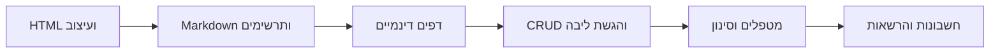

{: .box-note}
כאן תמצאו את הדרך לבניית האתר שלכם: מדף HTML ראשון, דרך עיצוב ומאמרים, ועד טפסים ששומרים נתונים. פתחו את השיעור שבו אתם נמצאים והמשיכו לבנות.

<!-- lesson-back:start -->
[חזרה: הפרויקט שלנו: מאתר אישי ליישום עם נתונים]({{ '/taba/00-teacher-plan/' | relative_url }})
<!-- lesson-back:end -->

## איך מתחילים?

צרו קובץ HTML ופתחו אותו בדפדפן. בשיעור הבא תריצו את האתר בסביבת הפיתוח, כשהדפדפן פתוח לצד העורך, ותראו את השינויים ב־HTML וב־CSS.

## הרגל שעוזר לאורך השנה

בתחילת העבודה: Pull. במהלך העבודה: commits קטנים ומשמעותיים. בסיום: Commit ו־Push ובדיקה ב־GitHub. לפחות 50 commits לאורך השנה, גם אם עובדים תמיד באותו מחשב נייד. אם מופיעה התנגשות פונים למורה ושומרים על העבודה.

## מה נבנה?

| יחידה | מסלול |
| ---: | ---: |
| [הדף הראשון שלי]({{ '/taba/01-first-page' | relative_url }}) | ליבה |
| [סביבת הפיתוח ו־GitHub: מתחילים הרגלי עבודה]({{ '/taba/01a-development-git' | relative_url }}) | ליבה |
| [האתר הופך לשלי]({{ '/taba/02-my-theme' | relative_url }}) | ליבה |
| [מעצבים עם CSS]({{ '/taba/03-css-classes' | relative_url }}) | ליבה |
| [אתר שנראה טוב עם Bootstrap]({{ '/taba/04-bootstrap' | relative_url }}) | ליבה |
| [מחברים דפים ובונים טופס]({{ '/taba/05-pages-and-forms' | relative_url }}) | ליבה |
| [כותבים תוכן ב־Markdown]({{ '/taba/05a-markdown' | relative_url }}) | ליבה |
| [מציירים באמצעות טקסט: Mermaid]({{ '/taba/05b-mermaid' | relative_url }}) | ליבה |
| [מבינים את Razor Pages ואת התבנית המשותפת]({{ '/taba/06-razor-layout' | relative_url }}) | ליבה |
| [הדף הדינמי הראשון]({{ '/taba/07-first-dynamic-page' | relative_url }}) | ליבה |
| [מכרטיס HTML לאובייקט Animal]({{ '/taba/08-animal-model' | relative_url }}) | ליבה |
| [הנתונים נשמרים עם EF Core ו־SQLite]({{ '/taba/09-ef-sqlite' | relative_url }}) | ליבה |
| [מוסיפים חיה ובודקים קלט]({{ '/taba/10-create-validation' | relative_url }}) | ליבה |
| [מעדכנים ומוחקים רשומות]({{ '/taba/11-edit-delete' | relative_url }}) | ליבה |
| [משלימים ומציגים אתר אישי עם CRUD]({{ '/taba/12-core-project' | relative_url }}) | ליבה |
| [מטפל וחיות: קשר אחד־לרבים]({{ '/taba/13-keepers-animals' | relative_url }}) | הרחבה |
| [מנהלים מטפלים: CRUD וקשר קיים]({{ '/taba/13a-keeper-crud' | relative_url }}) | הרחבה |
| [מחפשים ומסננים נתונים]({{ '/taba/14-filtering' | relative_url }}) | הרחבה |
| [הרשמה וכניסה עם Microsoft Identity]({{ '/taba/15-local-identity' | relative_url }}) | הרחבה |
| [מרחיבים את פרופיל המשתמש]({{ '/taba/16-user-profile' | relative_url }}) | הרחבה |
| [מי רשאי לערוך? בעלות והרשאות]({{ '/taba/17-authorization' | relative_url }}) | הרחבה |
| [כניסה עם Google — הרחבת רשות]({{ '/taba/18-google-login' | relative_url }}) | הרחבה |

## נקודת הסיום הבסיסית

אתר אישי עם יצירה, קריאה, עריכה ומחיקה; בדיקת קלט; שמירה לאחר הפעלה מחדש; מאמר Markdown ותרשים שאתם מסבירים בעצמכם. לפני ההגשה ודאו שהטפסים פועלים ושהמידע נשמר גם לאחר הפעלה מחדש.

בכל תחנה תציגו למורה שינוי קטן ותסבירו את הקוד. AI יכול לסייע בהבנת שגיאה; הוא אינו כותב את הפרויקט במקומכם. בחרו בכל פעם משימה קטנה שאפשר להשלים, לבדוק ולשמור ב־commit.

<!-- lesson-next:start -->
---

## המשך

- [מתחילים: הדף הראשון שלי]({{ '/taba/01-first-page/' | relative_url }})
<!-- lesson-next:end -->
